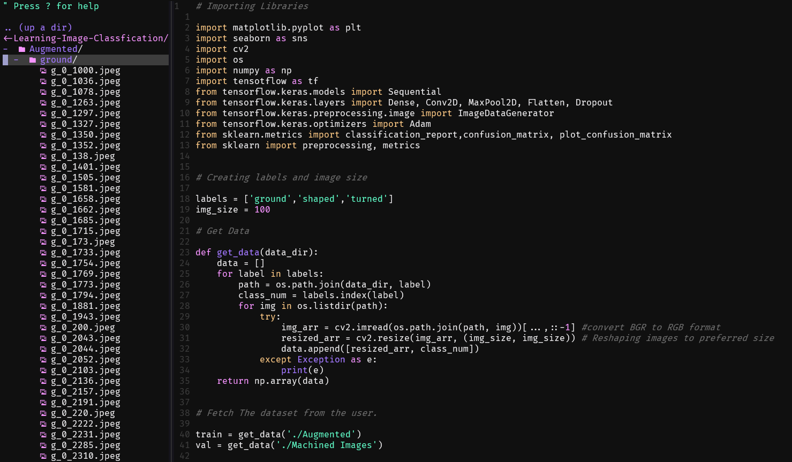
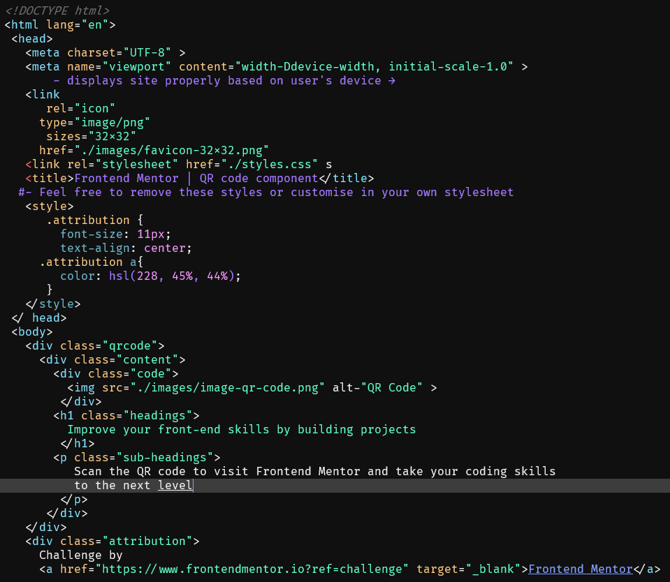
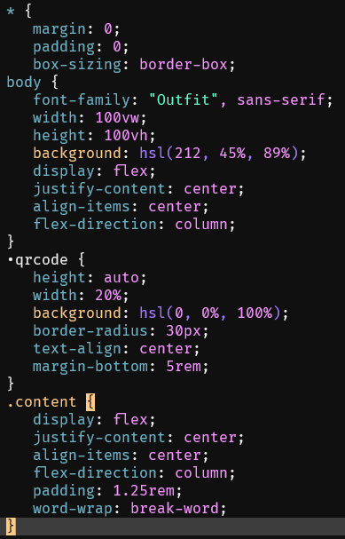
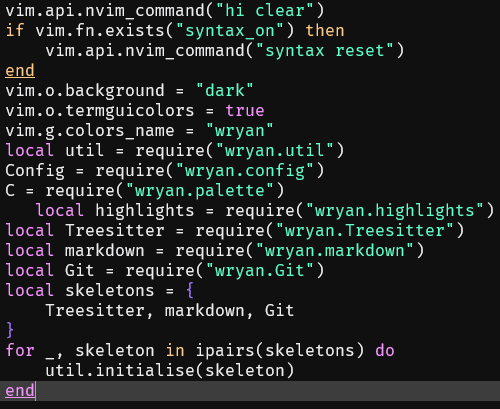
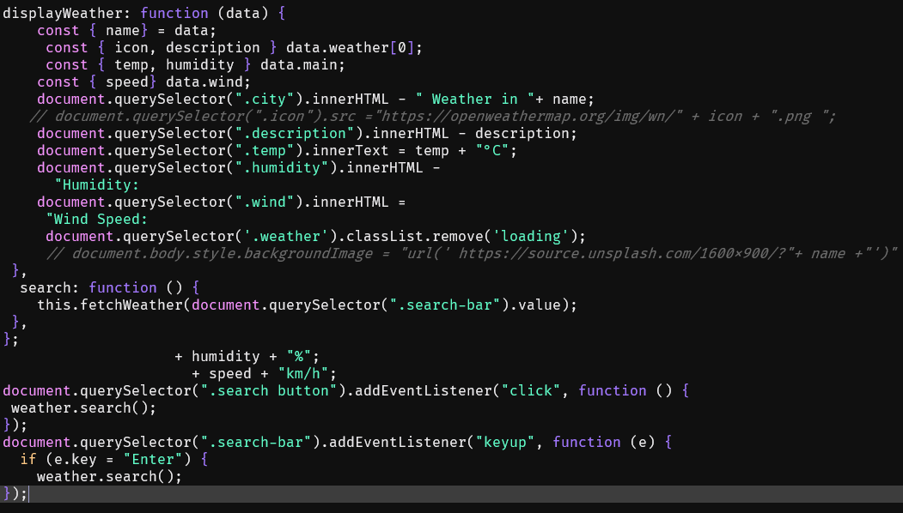

# Aura Neovim Colorscheme
<br>

Neovim colorscheme inspired by [Aura Theme](https://github.com/daltonmenezes/aura-theme) created by [Dalton Menezes](https://github.com/daltonmenezes).


<br>


## Usage
<br>

```vim

Plug 'techtuner/aura-neovim' "Vim-Plug
Plugin 'techtuner/aura-neovim' "Vundle

colorscheme aura
set termguicolors

```

You have to set `set termguicolors` in the `init.vim` file for the colors to render properly.
<br>

## Screenshots
<br>

1. **HTML**
<br>


<br>

2. **CSS**
<br>


<br>

3. **Lua**
<br>


<br>

4. **JavaScript**
<br>


<br>

## License
<br>

[Aura-neovim](https://www.github.com/techtuner/aura-neovim) is licensed under [MIT](./LICENSE)

<br>

## Other neovim Theme
<br>

[Wryan Theme](https://www.github.com/techtuner/wryan-neovim)
